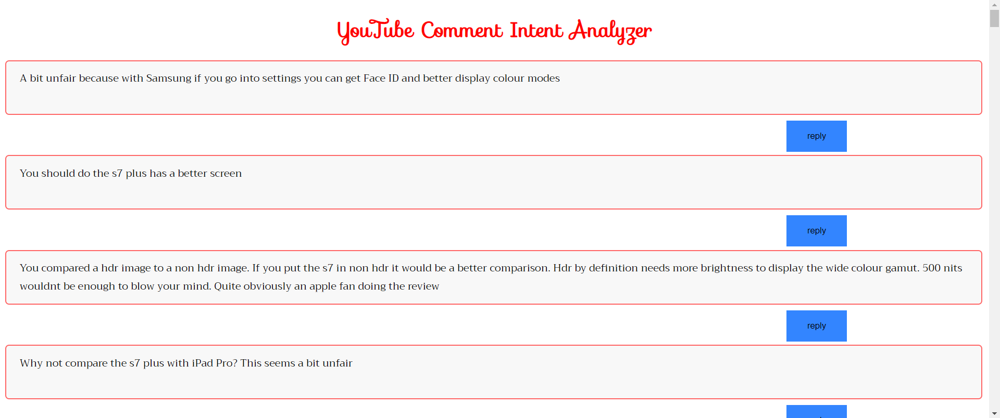
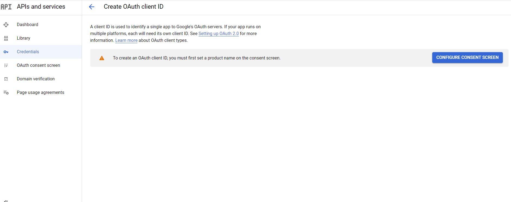

# youtube_comment_intent
This app helps to know your subscribers and improve the content. It also helps in knowing what people think about the advertised product in a product review videos.

I have explained what is data centric AI with this use case as an example.[Data_centric_doc.pdf](https://github.com/anesh-ml/youtube_comment_intent/files/8483360/Data_centric_doc.pdf)

## Features

**1. Get to know your subscribers',**
- Questions
- Suggestions/ideas
- Requests
- positive things
- Criticisms and miscellaneous

**2. Filter by words for each category**
- Users can know what their audiences are talking about a particular topic. For instance, in a "samsung s7 plus Vs Ipadpro" video, users can get to know the positives of s7 plus or ipad pro by giving the keywords "samsung, s7 plus" or "ipad, pro".

**3. Reply to the audience's comments directly from the application**
- Users can directly reply to the comments from the app. 

**4. Get top N comments for each category**

- Get to know the top N comments for each category.
- **Note:** It does not return exactly top N comments rather it returns all the comments that contain the top N words.

## Output

- Here are the **suggestions/ideas** give by the youtube users about s7 and ipad pro in review video.

**S7**

**Ipad pro**

## Requirements

- Youtube api
- Download the trained model here https://drive.google.com/drive/folders/1qyoQObicY3q3zhBEo79dNgfRr1j3Vyhf?usp=sharing. Download the entire `model` folder

## Steps to create Youtube api

1. Go to https://console.cloud.google.com/apis/

2. Create a new project

3. go to **APIs and Services --> Credentials --> CREATE CREDENTIALS -->OAuth client ID**

4. Click **Configure Consent Screen**

5. Click **External** andthen **Create**

6.Enter the **App name** and your email id in **User Support mail** and finall at the end give the same email id in **Developer contact information** section. Then **Save and Continue**

7. Don't do anything in the **Scopes**. Just **Save and Continue**

8. **Add Users** in the **Test users**. Give your email id again.

9. Make sure that you see your email id in the **user information** like below and then click **Save and continue**

10. Now,again got to **Credentials--> CREATE CREDENTIALS-->OAuth client ID**. Then in the **Application Type** select **Web application**.Then give any name in the **Name** field.

11.  Then scroll down. You will see **Authorised redirect URIs**. Click **Add URI**. Give this URI **http://localhost:8080/**. Te click **Create**

12. Finally, you will get the api key and client secret file. Copy paste the apikey in the **get_top_intent.py** and **main_app.py**. Download the client secret file, which is a json file, and put it in the working directory. You wil have to copy the client secret file name and store it in a variable in the **main_app.py**

13. Make sure you **Create a youtube channel** if you don't have one with the email address you gave during **Create OAuth client**. When running the **main_app.py** file, you will be redirected to signin into your gmail account. Sign in with email address you gave durin **Create OAuth client**.
